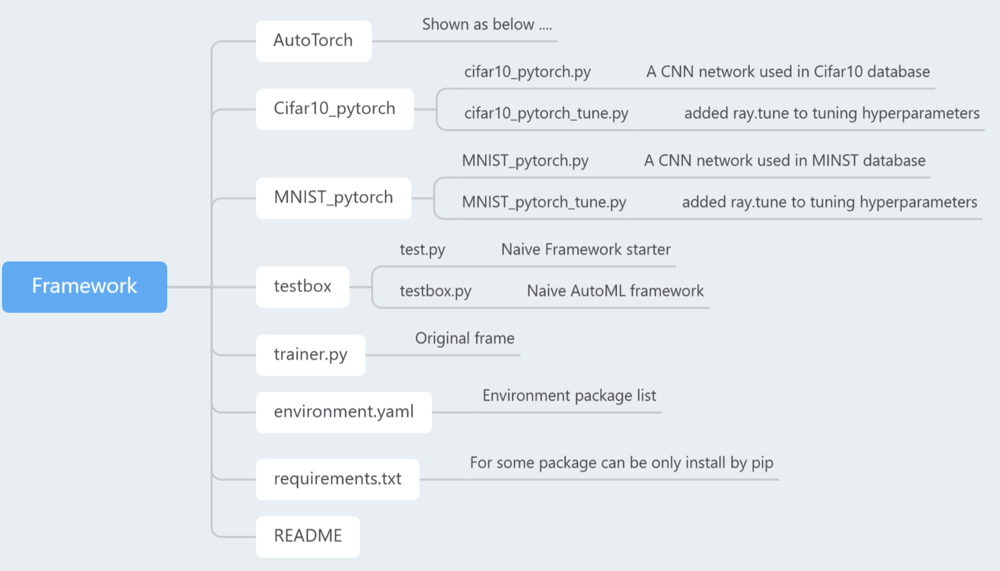
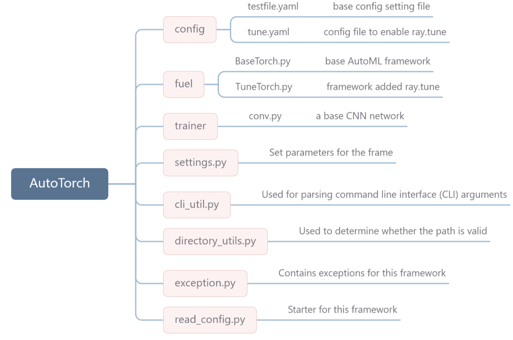

# AutoML Framework

## Environment

Python 3.10.10

#### Use:

```bash
conda env create -f environment.yaml
pip install -r requirements.txt
```


## High-level Description



### AutoTorch



## How to use

For the basic model, adjust various parameters in the config/testfile.yaml, and use:

```bash
python read_config.py config/testfile.yaml --run-id=<run-identifier>
```


You can use:

```bash
python read_congig.py --help
```

view all available command line parameters.


You can resume the training and force start it through parameters '--resume' and '--force'.

```bash
python read_config.py config/testfile.yaml --run-id=test_1 --resume
```

```bash
python read_config.py config/testfile.yaml --run-id=test_1 --force
```


Enable tune parameters like file in the config/tune.yaml to enable ray.tune:

```bash
python read_config.py config/tune.yaml --run-id=<run-identifier>
```

